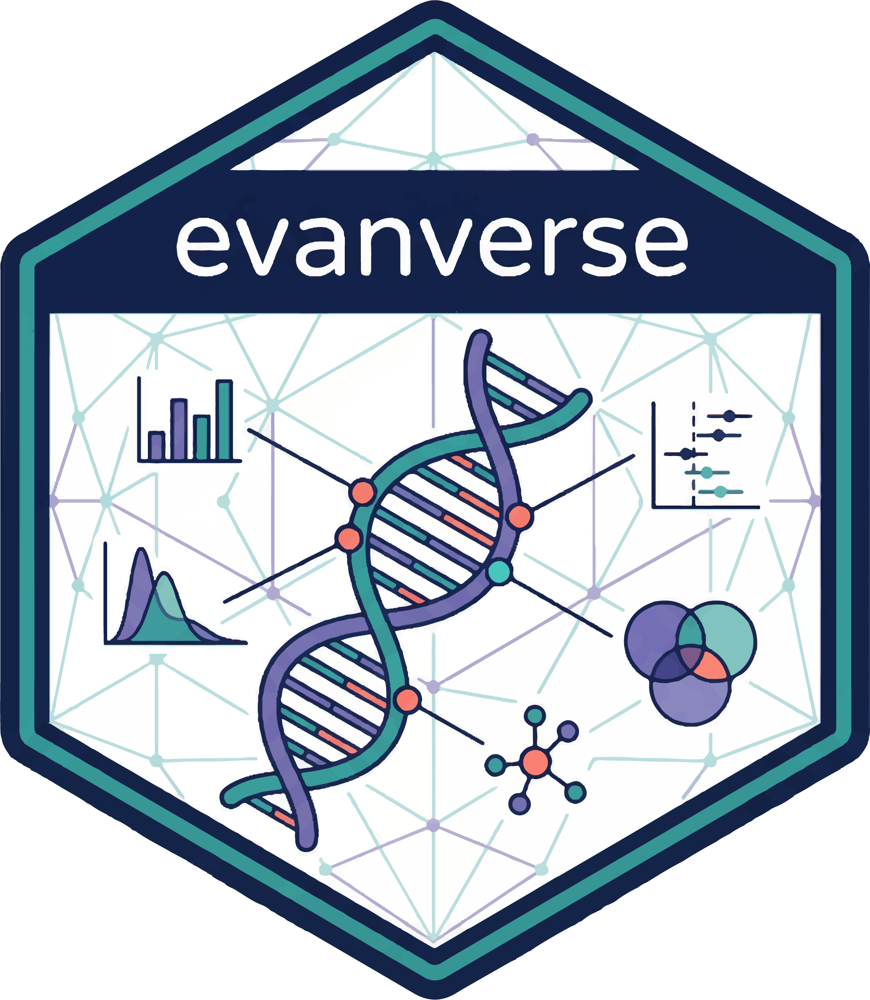

<p align="center">
  
</p>

# evanverse

<!-- badges: start -->
[](https://cran.r-project.org/package=evanverse)
[](https://github.com/evanbio/evanverse/releases)
[](LICENSE.md)
<!-- badges: end -->

**evanverse** is a comprehensive R utility package by Evan Zhou that provides a unified toolkit for data analysis, visualization, and bioinformatics workflows. It combines practical functions for package management, data processing, color palettes, plotting, and workflow automation.

## Features

- 📦 **Package Management**: Multi-source installation (CRAN, GitHub, Bioconductor), version checking, and updates
- 🎨 **Color & Visualization**: Bioinformatics color palettes, plotting functions (Venn, forest, bar, pie, density)
- 🔧 **Data Processing**: Flexible file I/O, gene ID conversion, void value handling, column mapping
- 🧮 **Operators & Logic**: Custom infix operators (%p%, %is%, %nin%, %map%, %match%), logical utilities
- 🌐 **Download & Network**: URL downloading with retry, GEO data fetching, batch operations
- ⚙️ **Workflow Tools**: Timing, reminders, safe execution, interactive viewing

## Installation

### 🚀 CRAN (Recommended - Under Review)

`evanverse` 0.3.3 is currently under CRAN review. Once approved, install with:

```r
install.packages("evanverse")
```

### 📦 Development Version

You can install the latest development version from GitHub:

```r
# install.packages("devtools")
devtools::install_github("evanbio/evanverse")
```

> **Status Update**: Version 0.3.3 has passed CRAN automatic checks and is pending manual review. Expected approval within 10 working days.

## Usage

```r
library(evanverse)

# Quick examples
"Hello" %p% "world"              # String concatenation
c(1, 2, NA) %is% c(1, 2, NA)     # Identity comparison
file_tree(".")                   # View project structure
```

## Functions Overview

evanverse v0.3.0 provides 55+ utility functions organized by category:

### 📦 Package Management
- `check_pkg()`, `inst_pkg()`, `update_pkg()`, `pkg_version()`, `pkg_functions()`, `set_mirror()`

### 🎨 Visualization & Plotting
- `plot_venn()`, `plot_forest()`, `plot_bar()`, `plot_pie()`, `plot_density()`

### 🌈 Color Palettes
- `get_palette()`, `list_palettes()`, `create_palette()`, `preview_palette()`, `bio_palette_gallery()`, `compile_palettes()`, `remove_palette()`
- `hex2rgb()`, `rgb2hex()`

### 📁 File & Data I/O
- `read_table_flex()`, `read_excel_flex()`, `write_xlsx_flex()`, `download_url()`, `download_batch()`, `download_geo_data()`
- `file_info()`, `file_tree()`, `get_ext()`, `view()`

### 🧬 Bioinformatics
- `convert_gene_id()`, `download_gene_ref()`, `gmt2df()`, `gmt2list()`

### 🔧 Data Processing
- `df2list()`, `map_column()`, `is_void()`, `any_void()`, `drop_void()`, `replace_void()`, `cols_with_void()`, `rows_with_void()`

### 🧮 Operators & Logic
- `%p%`, `%is%`, `%nin%`, `%map%`, `%match%`
- `combine_logic()`, `comb()`, `perm()`

### ⚙️ Workflow Tools
- `with_timer()`, `remind()`, `safe_execute()`

## Documentation

Full documentation and vignettes available at:
👉 https://evanbio.github.io/evanverse/

## Contributing

This project is in active development and currently designed for personal use.  
Feedback and pull requests are welcome in future versions.

## License

MIT License © 2025 Evan Zhou

---


