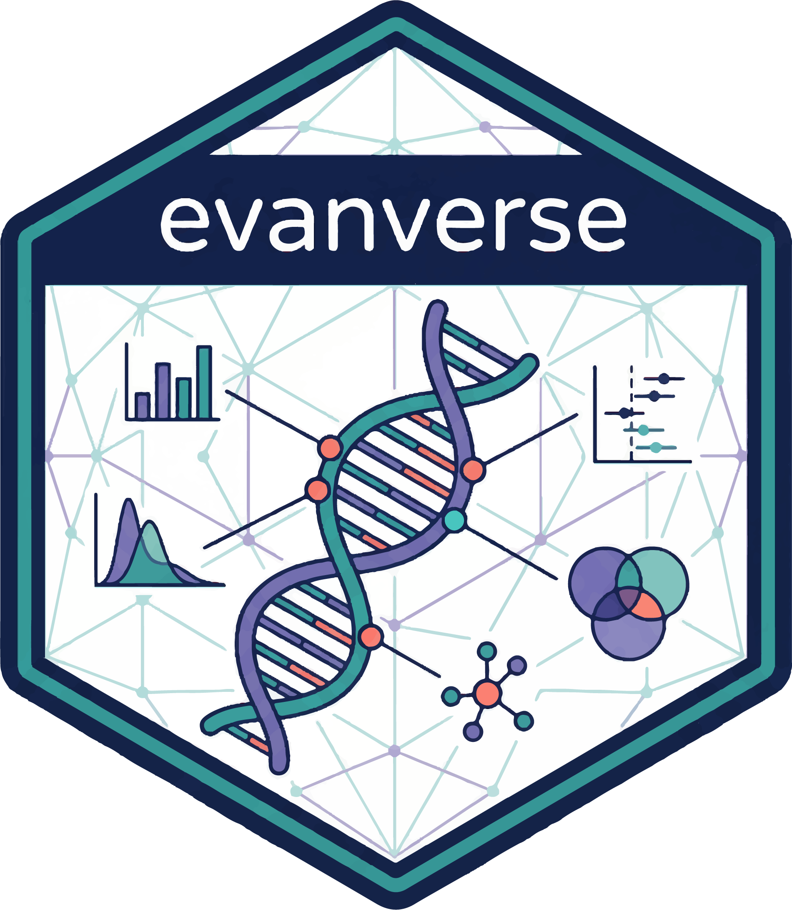

# evanverse



### *现代化的 R 数据科学与生物信息学工具包*

[](https://CRAN.R-project.org/package=evanverse)
[](https://github.com/evanbio/evanverse/actions/workflows/R-CMD-check.yaml)
[](https://codecov.io/gh/evanbio/evanverse?branch=main)
[](https://lifecycle.r-lib.org/articles/stages.html#stable)
[](https://CRAN.R-project.org/package=evanverse)

[📚 文档](https://evanbio.github.io/evanverse/) • [🚀
快速开始](https://evanbio.github.io/evanverse/articles/get-started.html)
• [💬 问题反馈](https://github.com/evanbio/evanverse/issues) • [🤝
参与贡献](https://evanbio.github.io/evanverse/CONTRIBUTING.md)

------------------------------------------------------------------------

**语言版本:** [English](https://evanbio.github.io/evanverse/README.md)
\| 简体中文

------------------------------------------------------------------------

## ✨ 项目简介

**evanverse** 是一个全面的 R 工具包，旨在简化您的数据分析工作流程。由
[Evan Zhou](mailto:evanzhou.bio@gmail.com) 开发，将 60+
个精心设计的函数集成到一个统一的工具包中，涵盖数据分析、可视化、统计检验和生物信息学等领域。

### 为什么选择 evanverse？

``` r
# 🎯 直观的操作符
"你好" %p% "世界"                      # → "你好世界"

# 🎨 优雅的可视化
plot_venn(list(A = 1:5, B = 3:8))     # 快速绘制韦恩图

# 📦 智能包管理
inst_pkg("dplyr", source = "CRAN")     # 多源安装包

# 🧬 生物信息学变简单
convert_gene_id(genes, from = "SYMBOL", to = "ENSEMBL")
```

------------------------------------------------------------------------

## 🚀 安装

### 稳定版本 (CRAN)

``` r
install.packages("evanverse")
```

### 开发版本

``` r
# install.packages("devtools")
devtools::install_github("evanbio/evanverse")
```

**系统要求:** R ≥ 4.1.0

------------------------------------------------------------------------

## 🎯 核心功能

[TABLE]

------------------------------------------------------------------------

## 💡 快速示例

### 字符串操作

``` r
library(evanverse)

# 使用 %p% 拼接字符串
first_name %p% " " %p% last_name

# 检查元素不在集合中
5 %nin% c(1, 2, 3, 4)  # TRUE
```

### 配色方案

``` r
# 列出所有可用配色
list_palettes()

# 获取配色方案
colors <- get_palette("celltype", n = 5)

# 预览配色
preview_palette("celltype")
```

### 文件操作

``` r
# 灵活读取表格数据
data <- read_table_flex("data.csv")

# 可视化目录树
file_tree(".", max_depth = 2)
```

### 生物信息学工作流

``` r
# 转换基因 ID
genes <- c("TP53", "BRCA1", "EGFR")
ensembl_ids <- convert_gene_id(genes, from = "SYMBOL", to = "ENSEMBL")

# 解析 GMT 文件
pathways <- gmt2list("pathway.gmt")
```

### 包管理

``` r
# 从多个源安装包
inst_pkg(c("dplyr", "ggplot2"), source = "CRAN")
inst_pkg("limma", source = "Bioconductor")
inst_pkg("user/repo", source = "GitHub")

# 检查版本
pkg_version("evanverse")
```

------------------------------------------------------------------------

## 📖 功能分类

**📦 包管理** (6 个函数)

- [`check_pkg()`](https://evanbio.github.io/evanverse/reference/check_pkg.md) -
  检查包是否已安装
- [`inst_pkg()`](https://evanbio.github.io/evanverse/reference/inst_pkg.md) -
  从多个源安装包
- [`update_pkg()`](https://evanbio.github.io/evanverse/reference/update_pkg.md) -
  更新已安装的包
- [`pkg_version()`](https://evanbio.github.io/evanverse/reference/pkg_version.md) -
  获取包版本
- [`pkg_functions()`](https://evanbio.github.io/evanverse/reference/pkg_functions.md) -
  列出包中的函数
- [`set_mirror()`](https://evanbio.github.io/evanverse/reference/set_mirror.md) -
  配置 CRAN 镜像

**🎨 可视化与绘图** (5 个函数)

- [`plot_venn()`](https://evanbio.github.io/evanverse/reference/plot_venn.md) -
  韦恩图
- [`plot_forest()`](https://evanbio.github.io/evanverse/reference/plot_forest.md) -
  森林图（支持高级自定义）
- [`plot_bar()`](https://evanbio.github.io/evanverse/reference/plot_bar.md) -
  柱状图
- [`plot_pie()`](https://evanbio.github.io/evanverse/reference/plot_pie.md) -
  饼图
- [`plot_density()`](https://evanbio.github.io/evanverse/reference/plot_density.md) -
  密度图

**📊 统计分析** (6 个函数)

- [`quick_ttest()`](https://evanbio.github.io/evanverse/reference/quick_ttest.md) -
  智能 t 检验（自动假设检验）
- [`quick_anova()`](https://evanbio.github.io/evanverse/reference/quick_anova.md) -
  单因素方差分析（含事后检验）
- [`quick_chisq()`](https://evanbio.github.io/evanverse/reference/quick_chisq.md) -
  卡方检验（含可视化）
- [`quick_cor()`](https://evanbio.github.io/evanverse/reference/quick_cor.md) -
  相关性分析（含热力图）
- [`stat_power()`](https://evanbio.github.io/evanverse/reference/stat_power.md) -
  统计功效分析
- [`stat_samplesize()`](https://evanbio.github.io/evanverse/reference/stat_samplesize.md) -
  样本量计算

**🎯 ggplot2 集成** (3 个函数)

- [`scale_color_evanverse()`](https://evanbio.github.io/evanverse/reference/scale_evanverse.md) -
  ggplot2 颜色标度
- [`scale_fill_evanverse()`](https://evanbio.github.io/evanverse/reference/scale_evanverse.md) -
  ggplot2 填充标度
- [`scale_colour_evanverse()`](https://evanbio.github.io/evanverse/reference/scale_evanverse.md) -
  英式拼写别名

**🌈 配色方案** (9 个函数)

- [`get_palette()`](https://evanbio.github.io/evanverse/reference/get_palette.md) -
  获取配色方案
- [`list_palettes()`](https://evanbio.github.io/evanverse/reference/list_palettes.md) -
  列出可用配色
- [`create_palette()`](https://evanbio.github.io/evanverse/reference/create_palette.md) -
  创建自定义配色
- [`preview_palette()`](https://evanbio.github.io/evanverse/reference/preview_palette.md) -
  预览配色
- [`bio_palette_gallery()`](https://evanbio.github.io/evanverse/reference/bio_palette_gallery.md) -
  浏览生物配色库
- [`compile_palettes()`](https://evanbio.github.io/evanverse/reference/compile_palettes.md) -
  编译配色数据
- [`remove_palette()`](https://evanbio.github.io/evanverse/reference/remove_palette.md) -
  删除配色
- [`hex2rgb()`](https://evanbio.github.io/evanverse/reference/hex2rgb.md) -
  十六进制转 RGB
- [`rgb2hex()`](https://evanbio.github.io/evanverse/reference/rgb2hex.md) -
  RGB 转十六进制

**📁 文件与数据读写** (10 个函数)

- [`read_table_flex()`](https://evanbio.github.io/evanverse/reference/read_table_flex.md) -
  灵活读取表格
- [`read_excel_flex()`](https://evanbio.github.io/evanverse/reference/read_excel_flex.md) -
  灵活读取 Excel
- [`write_xlsx_flex()`](https://evanbio.github.io/evanverse/reference/write_xlsx_flex.md) -
  灵活写入 Excel
- [`download_url()`](https://evanbio.github.io/evanverse/reference/download_url.md) -
  从 URL 下载
- [`download_batch()`](https://evanbio.github.io/evanverse/reference/download_batch.md) -
  批量下载
- [`download_geo_data()`](https://evanbio.github.io/evanverse/reference/download_geo_data.md) -
  下载 GEO 数据集
- [`file_info()`](https://evanbio.github.io/evanverse/reference/file_info.md) -
  文件信息
- [`file_tree()`](https://evanbio.github.io/evanverse/reference/file_tree.md) -
  目录树
- [`get_ext()`](https://evanbio.github.io/evanverse/reference/get_ext.md) -
  获取文件扩展名
- [`view()`](https://evanbio.github.io/evanverse/reference/view.md) -
  交互式数据查看器

**🧬 生物信息学** (4 个函数)

- [`convert_gene_id()`](https://evanbio.github.io/evanverse/reference/convert_gene_id.md) -
  基因 ID 转换
- [`download_gene_ref()`](https://evanbio.github.io/evanverse/reference/download_gene_ref.md) -
  下载基因参考数据
- [`gmt2df()`](https://evanbio.github.io/evanverse/reference/gmt2df.md) -
  GMT 转数据框
- [`gmt2list()`](https://evanbio.github.io/evanverse/reference/gmt2list.md) -
  GMT 转列表

**🔧 数据处理** (10 个函数)

- [`df2list()`](https://evanbio.github.io/evanverse/reference/df2list.md) -
  数据框转列表
- [`map_column()`](https://evanbio.github.io/evanverse/reference/map_column.md) -
  映射列值
- [`is_void()`](https://evanbio.github.io/evanverse/reference/void.md) -
  检查空值
- [`any_void()`](https://evanbio.github.io/evanverse/reference/void.md) -
  是否有空值
- [`drop_void()`](https://evanbio.github.io/evanverse/reference/void.md) -
  删除空值
- [`replace_void()`](https://evanbio.github.io/evanverse/reference/void.md) -
  替换空值
- [`cols_with_void()`](https://evanbio.github.io/evanverse/reference/void.md) -
  含空值的列
- [`rows_with_void()`](https://evanbio.github.io/evanverse/reference/void.md) -
  含空值的行

**🧮 操作符与逻辑** (8 个函数)

- `%p%` - 字符串拼接操作符
- `%is%` - 身份比较
- `%nin%` - 非成员操作符
- `%map%` - 映射操作符
- `%match%` - 匹配操作符
- [`combine_logic()`](https://evanbio.github.io/evanverse/reference/combine_logic.md) -
  组合逻辑向量
- [`comb()`](https://evanbio.github.io/evanverse/reference/comb.md) -
  组合数
- [`perm()`](https://evanbio.github.io/evanverse/reference/perm.md) -
  排列数

**⚙️ 工作流工具** (3 个函数)

- [`with_timer()`](https://evanbio.github.io/evanverse/reference/with_timer.md) -
  计时执行
- [`remind()`](https://evanbio.github.io/evanverse/reference/remind.md) -
  设置提醒
- [`safe_execute()`](https://evanbio.github.io/evanverse/reference/safe_execute.md) -
  安全函数执行

------------------------------------------------------------------------

## 📚 文档资源

完整的文档、示例和教程：

👉 **<https://evanbio.github.io/evanverse/>**

------------------------------------------------------------------------

## 🤝 参与贡献

我们欢迎各种形式的贡献！详情请参阅
[贡献指南](https://evanbio.github.io/evanverse/CONTRIBUTING.md)。

- 🐛 [报告
  Bug](https://github.com/evanbio/evanverse/issues/new?template=bug_report.yml)
- 💡
  [功能建议](https://github.com/evanbio/evanverse/issues/new?template=feature_request.yml)
- 📖
  [改进文档](https://github.com/evanbio/evanverse/issues/new?template=documentation.yml)
- ❓
  [提问交流](https://github.com/evanbio/evanverse/issues/new?template=question.yml)

------------------------------------------------------------------------

## 📜 开源协议

MIT License © 2025-2026 [Evan Zhou](mailto:evanzhou.bio@gmail.com)

详见 [LICENSE.md](https://evanbio.github.io/evanverse/LICENSE.md)。

------------------------------------------------------------------------

## 📊 项目状态

- ✅ **已发布至 CRAN** - 版本 0.4.0
- ✅ **稳定生命周期** - 生产环境可用
- ✅ **全面测试覆盖** - 完善的测试套件
- ✅ **持续维护** - 定期更新

------------------------------------------------------------------------

**用 ❤️ 制作 by [Evan Zhou](https://github.com/evanbio)**

[⬆ 返回顶部](#evanverse)
