# Publication-Ready Forest Plots with evanverse

``` r
library(evanverse)
library(dplyr)
library(grid)
```

## 🌲 Introduction

Forest plots are essential visualization tools in biomedical research,
epidemiology, and statistical analysis. They excel at presenting:

- **Regression analysis results** (Logistic, Cox proportional hazards)
- **Meta-analysis** (combining multiple studies)
- **Subgroup comparisons** (stratified analyses)

A well-designed forest plot not only conveys statistical results clearly
but also meets publication standards for journals and conferences.

### Why evanverse?

While R has several packages for creating forest plots (e.g.,
`forestplot`, `forestploter`, `meta`), **evanverse** provides:

✅ **Publication-ready defaults** - Beautiful themes out of the box ✅
**Comprehensive customization** - 40+ parameters for fine control ✅
**Multi-model comparison** - Compare multiple regression models
side-by-side ✅ **Intelligent automation** - Auto-formatting, alignment,
and significance highlighting ✅ **Batch processing** - Efficient
workflows for large-scale analyses

This vignette demonstrates how to create professional forest plots from
basic examples to advanced customizations.

------------------------------------------------------------------------

## 📊 Understanding Forest Plots

### What is a Forest Plot?

A forest plot displays effect estimates and their confidence intervals
for multiple variables or studies. Each row represents:

- **Variable name** - The predictor or study identifier
- **Point estimate** - Effect size (OR, HR, RR, MD, etc.)
- **Confidence interval** - Uncertainty range (typically 95% CI)
- **P-value** - Statistical significance indicator
- **Reference line** - No-effect threshold (OR/HR = 1, MD = 0)

### Key Components

    ┌─────────────┬────────────┬───────────┬─────────┐
    │ Variable    │   CI Plot  │ OR (CI)   │ P-value │
    ├─────────────┼────────────┼───────────┼─────────┤
    │ Age ≥65     │  ──■──     │ 1.45 (...)│ 0.001   │
    │ Male        │  ──■──     │ 0.88 (...)│ 0.189   │
    │ Smoking     │    ──■──   │ 1.67 (...)│ <0.001  │
    └─────────────┴────────────┴───────────┴─────────┘
                  ↑            ↑
             Reference      Estimate
                line        & CI box

### Common Applications

| Scenario            | Effect Measure       | Reference Line    |
|---------------------|----------------------|-------------------|
| Logistic Regression | Odds Ratio (OR)      | 1                 |
| Cox Regression      | Hazard Ratio (HR)    | 1                 |
| Risk Analysis       | Relative Risk (RR)   | 1                 |
| Mean Difference     | Mean Difference (MD) | 0                 |
| Meta-analysis       | Pooled Effect        | Depends on metric |

------------------------------------------------------------------------

## 🚀 Quick Start

### Installation

``` r
# Install from CRAN (when available)
install.packages("evanverse")

# Or install development version from GitHub
# install.packages("devtools")
devtools::install_github("evanbio/evanverse")
```

### Minimal Example (5 minutes)

Let’s create a basic forest plot using the built-in `forest_data`
dataset.

#### Step 1: Load and Inspect Data

``` r
# Load built-in example data
data("forest_data")

# Inspect structure
head(forest_data, 10)
#>        variable  est lower upper  pval est_2 lower_2 upper_2 pval_2 est_3
#> 1           Age 1.28  1.15  1.43 0.001    NA      NA      NA     NA    NA
#> 2           BMI 1.05  1.02  1.09 0.003    NA      NA      NA     NA    NA
#> 3           Sex   NA    NA    NA    NA    NA      NA      NA     NA    NA
#> 4          Male 1.42  1.10  1.83 0.007    NA      NA      NA     NA    NA
#> 5        Female 0.88  0.65  1.18 0.380    NA      NA      NA     NA    NA
#> 6  BMI category   NA    NA    NA    NA    NA      NA      NA     NA    NA
#> 7           <25 1.00  0.75  1.33 1.000    NA      NA      NA     NA    NA
#> 8         25-30 1.35  0.95  1.92 0.095    NA      NA      NA     NA    NA
#> 9           ≥30 1.78  1.25  2.53 0.002    NA      NA      NA     NA    NA
#> 10      Smoking   NA    NA    NA    NA    NA      NA      NA     NA    NA
#>    lower_3 upper_3 pval_3 n_total n_event event_pct color_id note
#> 1       NA      NA     NA     850     210      24.7     cont <NA>
#> 2       NA      NA     NA     850     210      24.7     cont <NA>
#> 3       NA      NA     NA      NA      NA        NA     <NA> <NA>
#> 4       NA      NA     NA     425     120      28.2      sex <NA>
#> 5       NA      NA     NA     425      90      21.2      sex <NA>
#> 6       NA      NA     NA      NA      NA        NA     <NA> <NA>
#> 7       NA      NA     NA     320      55      17.2      bmi <NA>
#> 8       NA      NA     NA     310      72      23.2      bmi <NA>
#> 9       NA      NA     NA     220      83      37.7      bmi <NA>
#> 10      NA      NA     NA      NA      NA        NA     <NA> <NA>
```

#### Step 2: Prepare Display Data

The key to
[`plot_forest()`](https://evanbio.github.io/evanverse/reference/plot_forest.md)
is preparing a **display data frame** with all text columns you want to
show.

``` r
# Filter single-model data
df_single <- forest_data %>%
  filter(is.na(est_2)) %>%      # Single model (no est_2)
  filter(!is.na(est)) %>%        # Remove header rows
  head(10)                       # First 10 rows for demo

# Create display table
plot_data <- df_single %>%
  mutate(
    ` ` = strrep(" ", 20),       # Blank column for CI graphic
    `OR (95% CI)` = sprintf("%.2f (%.2f-%.2f)", est, lower, upper),
    `P` = ifelse(pval < 0.001, "<0.001", sprintf("%.3f", pval)),
    `N` = n_total
  ) %>%
  select(Variable = variable, ` `, `OR (95% CI)`, `P`, `N`)

print(plot_data)
#>          Variable                           OR (95% CI)     P   N
#> 1             Age                      1.28 (1.15-1.43) 0.001 850
#> 2             BMI                      1.05 (1.02-1.09) 0.003 850
#> 3            Male                      1.42 (1.10-1.83) 0.007 425
#> 4          Female                      0.88 (0.65-1.18) 0.380 425
#> 5             <25                      1.00 (0.75-1.33) 1.000 320
#> 6           25-30                      1.35 (0.95-1.92) 0.095 310
#> 7             ≥30                      1.78 (1.25-2.53) 0.002 220
#> 8  Current/Former                      1.52 (1.18-1.96) 0.001 380
#> 9         Control                      1.00 (0.80-1.25) 1.000 280
#> 10    Treatment A                      0.68 (0.48-0.96) 0.028 285
```

#### Step 3: Create Forest Plot

``` r
# Create forest plot
p1 <- plot_forest(
  data = plot_data,
  est = list(df_single$est),
  lower = list(df_single$lower),
  upper = list(df_single$upper),
  ci_column = 2,                 # Column for CI graphic (blank column)
  ref_line = 1,                  # OR = 1 reference
  xlim = c(0.5, 2.5),
  arrow_lab = c("Lower Risk", "Higher Risk")
)
#> 
#> ── Layout Adjustment Summary
#> ℹ Column Widths (mm):
#> Default: 5, 36.3, 30.9, 38.5, 16.1, 12.1, 5
#> Adjusted: 10, 45, 40, 45, 25, 20, 10
#> width_custom = list({paste(width_code, collapse = ', ')})
#> ℹ Row Heights (mm):
#> Default: 5, 7.1, 6.1, 6.1, 6.1, 6.1, 6.1, 6.1, 6.1, 6.1, 6.1, 6.1, 9.7, 6.2, 5
#> Adjusted: 8, 12, 10, 10, 10, 10, 10, 10, 10, 10, 10, 10, 10, 10, 8
#> height_custom = list({paste(height_code, collapse = ', ')})
#> ✔ Tip: Copy and modify the code above for custom dimensions

print(p1)
```


**🎉 Congratulations!** You just created your first publication-ready
forest plot.

------------------------------------------------------------------------

## 🎨 Single-Model Forest Plots

Now let’s explore how to customize single-model forest plots for
different scenarios.

### Data Preparation Deep Dive

Understanding the data structure is crucial for
[`plot_forest()`](https://evanbio.github.io/evanverse/reference/plot_forest.md):

``` r
# YOUR data frame should have:
# 1. Display columns (text, formatted strings)
# 2. Numeric vectors for est, lower, upper (NOT in data frame)
# 3. A blank column (" ") where CI graphics will be drawn

plot_data <- data.frame(
  Variable = c("Age", "Sex", "BMI"),           # Display
  ` ` = rep(strrep(" ", 20), 3),               # Blank for CI
  `OR (95% CI)` = c("1.45 (...)", ...),        # Display
  `P` = c("0.001", "0.189", "0.045")           # Display
)

# Numeric vectors (not in data frame)
est_values <- c(1.45, 0.88, 1.35)
lower_values <- c(1.10, 0.65, 1.05)
upper_values <- c(1.83, 1.18, 1.71)
```

**Key Points:** - Display data and numeric data are **separate** - Use
[`sprintf()`](https://rdrr.io/r/base/sprintf.html) to format OR/HR
strings - Create blank column with `strrep(" ", width)`

### Theme Customization

#### Using Preset Themes

``` r
# Default theme (built-in)
p2 <- plot_forest(
  data = plot_data,
  est = list(df_single$est),
  lower = list(df_single$lower),
  upper = list(df_single$upper),
  ci_column = 2,
  ref_line = 1,
  theme_preset = "default"
)
#> 
#> ── Layout Adjustment Summary
#> ℹ Column Widths (mm):
#> Default: 5, 36.3, 30.9, 38.5, 16.1, 12.1, 5
#> Adjusted: 10, 45, 40, 45, 25, 20, 10
#> width_custom = list({paste(width_code, collapse = ', ')})
#> ℹ Row Heights (mm):
#> Default: 5, 7.1, 6.1, 6.1, 6.1, 6.1, 6.1, 6.1, 6.1, 6.1, 6.1, 6.1, 9.7, 5
#> Adjusted: 8, 12, 10, 10, 10, 10, 10, 10, 10, 10, 10, 10, 10, 8
#> height_custom = list({paste(height_code, collapse = ', ')})
#> ✔ Tip: Copy and modify the code above for custom dimensions

print(p2)
```


#### Custom Theme Parameters

``` r
# Override specific theme parameters
p3 <- plot_forest(
  data = plot_data,
  est = list(df_single$est),
  lower = list(df_single$lower),
  upper = list(df_single$upper),
  ci_column = 2,
  ref_line = 1,
  theme_custom = list(
    base_size = 14,              # Larger font
    ci_pch = 18,                 # Diamond shape
    ci_lwd = 2,                  # Thicker lines
    ci_fill = "#4DBBD5",         # Custom color
    ci_Theight = 0.15            # Box height
  )
)
#> 
#> ── Layout Adjustment Summary
#> ℹ Column Widths (mm):
#> Default: 5, 41.7, 35.4, 44.2, 18.1, 13.4, 5
#> Adjusted: 10, 50, 45, 50, 25, 20, 10
#> width_custom = list({paste(width_code, collapse = ', ')})
#> ℹ Row Heights (mm):
#> Default: 5, 7.6, 6.6, 6.6, 6.6, 6.6, 6.6, 6.6, 6.6, 6.6, 6.6, 6.6, 9.7, 5
#> Adjusted: 8, 12, 10, 10, 10, 10, 10, 10, 10, 10, 10, 10, 10, 8
#> height_custom = list({paste(height_code, collapse = ', ')})
#> ✔ Tip: Copy and modify the code above for custom dimensions

print(p3)
```

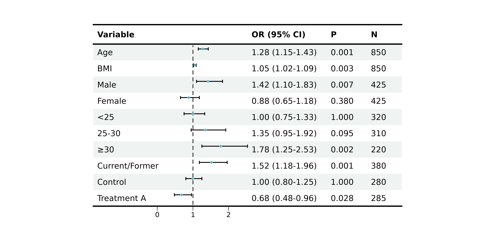

### Text Alignment

Professional tables require proper alignment:

``` r
p4 <- plot_forest(
  data = plot_data,
  est = list(df_single$est),
  lower = list(df_single$lower),
  upper = list(df_single$upper),
  ci_column = 2,
  ref_line = 1,
  align_left = 1,                # Variable names left
  align_center = c(2, 3),        # CI column and OR center
  align_right = c(4, 5)          # P-value and N right
)
#> 
#> ── Layout Adjustment Summary
#> ℹ Column Widths (mm):
#> Default: 5, 36.3, 30.9, 38.5, 16.1, 12.1, 5
#> Adjusted: 10, 45, 40, 45, 25, 20, 10
#> width_custom = list({paste(width_code, collapse = ', ')})
#> ℹ Row Heights (mm):
#> Default: 5, 7.1, 6.1, 6.1, 6.1, 6.1, 6.1, 6.1, 6.1, 6.1, 6.1, 6.1, 9.7, 5
#> Adjusted: 8, 12, 10, 10, 10, 10, 10, 10, 10, 10, 10, 10, 10, 8
#> height_custom = list({paste(height_code, collapse = ', ')})
#> ✔ Tip: Copy and modify the code above for custom dimensions

print(p4)
```

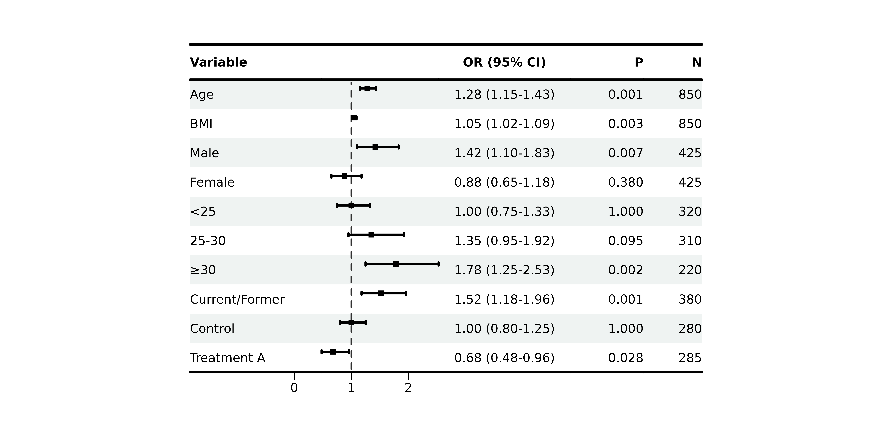

### Bold Formatting

#### Highlighting Group Headers

``` r
# Assuming "Sex" and "BMI category" are group headers
p5 <- plot_forest(
  data = plot_data,
  est = list(df_single$est),
  lower = list(df_single$lower),
  upper = list(df_single$upper),
  ci_column = 2,
  ref_line = 1,
  bold_group = c("Sex", "BMI category"),
  bold_group_col = 1
)
#> 
#> ── Layout Adjustment Summary
#> ℹ Column Widths (mm):
#> Default: 5, 36.3, 30.9, 38.5, 16.1, 12.1, 5
#> Adjusted: 10, 45, 40, 45, 25, 20, 10
#> width_custom = list({paste(width_code, collapse = ', ')})
#> ℹ Row Heights (mm):
#> Default: 5, 7.1, 6.1, 6.1, 6.1, 6.1, 6.1, 6.1, 6.1, 6.1, 6.1, 6.1, 9.7, 5
#> Adjusted: 8, 12, 10, 10, 10, 10, 10, 10, 10, 10, 10, 10, 10, 8
#> height_custom = list({paste(height_code, collapse = ', ')})
#> ✔ Tip: Copy and modify the code above for custom dimensions

print(p5)
```

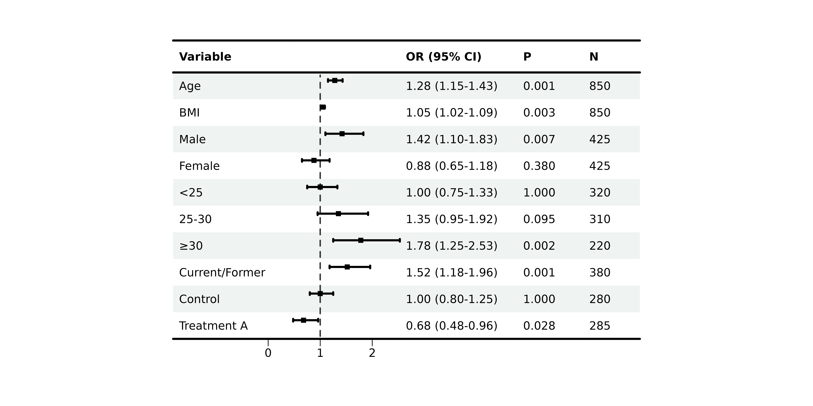

#### Auto-Bold Significant P-values

``` r
p6 <- plot_forest(
  data = plot_data,
  est = list(df_single$est),
  lower = list(df_single$lower),
  upper = list(df_single$upper),
  ci_column = 2,
  ref_line = 1,
  bold_pvalue_cols = 4,          # P-value column
  p_threshold = 0.05             # Significance level
)
#> 
#> ── Layout Adjustment Summary
#> ℹ Column Widths (mm):
#> Default: 5, 36.3, 30.9, 38.5, 16.1, 12.1, 5
#> Adjusted: 10, 45, 40, 45, 25, 20, 10
#> width_custom = list({paste(width_code, collapse = ', ')})
#> ℹ Row Heights (mm):
#> Default: 5, 7.1, 6.1, 6.1, 6.1, 6.1, 6.1, 6.1, 6.1, 6.1, 6.1, 6.1, 9.7, 5
#> Adjusted: 8, 12, 10, 10, 10, 10, 10, 10, 10, 10, 10, 10, 10, 8
#> height_custom = list({paste(height_code, collapse = ', ')})
#> ✔ Tip: Copy and modify the code above for custom dimensions

print(p6)
```

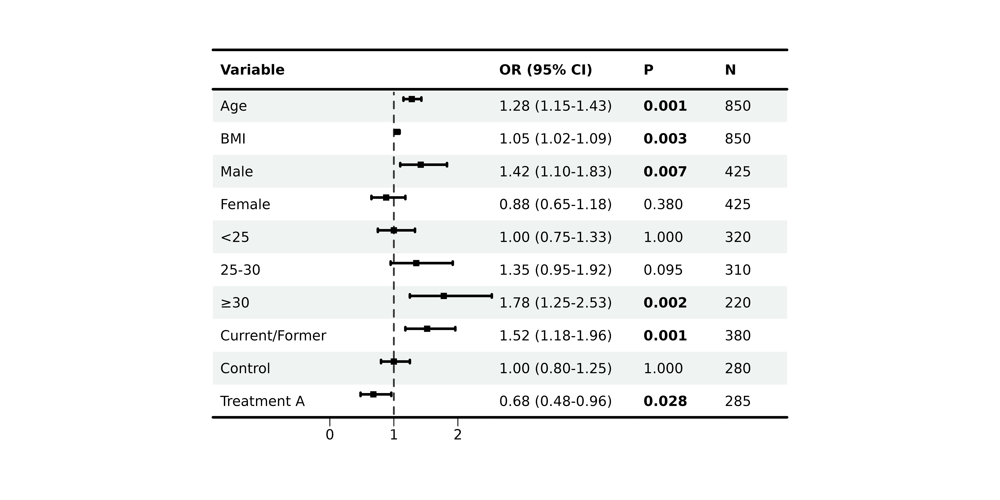

### Background Styles

#### Zebra Stripes

``` r
p7 <- plot_forest(
  data = plot_data,
  est = list(df_single$est),
  lower = list(df_single$lower),
  upper = list(df_single$upper),
  ci_column = 2,
  ref_line = 1,
  background_style = "zebra",
  background_colors = list(
    primary = "#F0F0F0",
    secondary = "white"
  )
)
#> 
#> ── Layout Adjustment Summary
#> ℹ Column Widths (mm):
#> Default: 5, 36.3, 30.9, 38.5, 16.1, 12.1, 5
#> Adjusted: 10, 45, 40, 45, 25, 20, 10
#> width_custom = list({paste(width_code, collapse = ', ')})
#> ℹ Row Heights (mm):
#> Default: 5, 7.1, 6.1, 6.1, 6.1, 6.1, 6.1, 6.1, 6.1, 6.1, 6.1, 6.1, 9.7, 5
#> Adjusted: 8, 12, 10, 10, 10, 10, 10, 10, 10, 10, 10, 10, 10, 8
#> height_custom = list({paste(height_code, collapse = ', ')})
#> ✔ Tip: Copy and modify the code above for custom dimensions

print(p7)
```

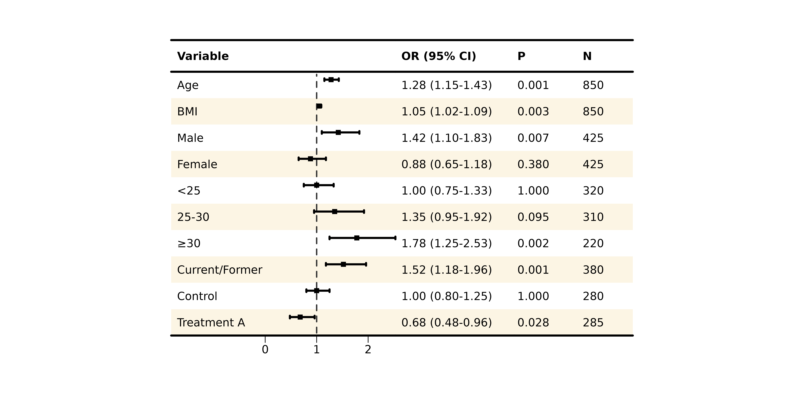

#### Group-based Coloring

``` r
# Identify rows that are group headers (NA in est)
group_rows <- which(is.na(df_single$est))

p8 <- plot_forest(
  data = plot_data,
  est = list(df_single$est),
  lower = list(df_single$lower),
  upper = list(df_single$upper),
  ci_column = 2,
  ref_line = 1,
  background_style = "group",
  background_group_rows = group_rows,
  background_colors = list(
    primary = "#E3F2FD",         # Group headers
    secondary = "white"          # Data rows
  )
)
#> Warning: Style 'group' requires `group_rows`. No background applied.
#> 
#> ── Layout Adjustment Summary
#> ℹ Column Widths (mm):
#> Default: 5, 36.3, 30.9, 38.5, 16.1, 12.1, 5
#> Adjusted: 10, 45, 40, 45, 25, 20, 10
#> width_custom = list({paste(width_code, collapse = ', ')})
#> ℹ Row Heights (mm):
#> Default: 5, 7.1, 6.1, 6.1, 6.1, 6.1, 6.1, 6.1, 6.1, 6.1, 6.1, 6.1, 9.7, 5
#> Adjusted: 8, 12, 10, 10, 10, 10, 10, 10, 10, 10, 10, 10, 10, 8
#> height_custom = list({paste(height_code, collapse = ', ')})
#> ✔ Tip: Copy and modify the code above for custom dimensions

print(p8)
```


### CI Colors

#### Single Color

``` r
p9 <- plot_forest(
  data = plot_data,
  est = list(df_single$est),
  lower = list(df_single$lower),
  upper = list(df_single$upper),
  ci_column = 2,
  ref_line = 1,
  ci_colors = "#E64B35"          # All boxes same color
)
#> 
#> ── Layout Adjustment Summary
#> ℹ Column Widths (mm):
#> Default: 5, 36.3, 30.9, 38.5, 16.1, 12.1, 5
#> Adjusted: 10, 45, 40, 45, 25, 20, 10
#> width_custom = list({paste(width_code, collapse = ', ')})
#> ℹ Row Heights (mm):
#> Default: 5, 7.1, 6.1, 6.1, 6.1, 6.1, 6.1, 6.1, 6.1, 6.1, 6.1, 6.1, 9.7, 5
#> Adjusted: 8, 12, 10, 10, 10, 10, 10, 10, 10, 10, 10, 10, 10, 8
#> height_custom = list({paste(height_code, collapse = ', ')})
#> ✔ Tip: Copy and modify the code above for custom dimensions

print(p9)
```


#### Color by Significance

``` r
# Color based on p-value
ci_cols <- ifelse(df_single$pval < 0.05, "#E64B35", "#CCCCCC")

p10 <- plot_forest(
  data = plot_data,
  est = list(df_single$est),
  lower = list(df_single$lower),
  upper = list(df_single$upper),
  ci_column = 2,
  ref_line = 1,
  ci_colors = ci_cols             # Vector matching rows
)
#> 
#> ── Layout Adjustment Summary
#> ℹ Column Widths (mm):
#> Default: 5, 36.3, 30.9, 38.5, 16.1, 12.1, 5
#> Adjusted: 10, 45, 40, 45, 25, 20, 10
#> width_custom = list({paste(width_code, collapse = ', ')})
#> ℹ Row Heights (mm):
#> Default: 5, 7.1, 6.1, 6.1, 6.1, 6.1, 6.1, 6.1, 6.1, 6.1, 6.1, 6.1, 9.7, 5
#> Adjusted: 8, 12, 10, 10, 10, 10, 10, 10, 10, 10, 10, 10, 10, 8
#> height_custom = list({paste(height_code, collapse = ', ')})
#> ✔ Tip: Copy and modify the code above for custom dimensions

print(p10)
```

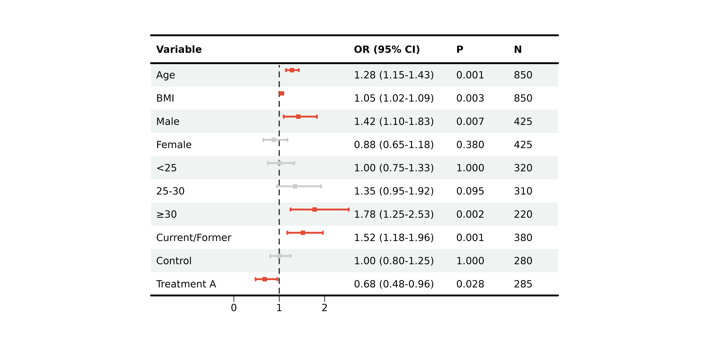

### Borders

``` r
p11 <- plot_forest(
  data = plot_data,
  est = list(df_single$est),
  lower = list(df_single$lower),
  upper = list(df_single$upper),
  ci_column = 2,
  ref_line = 1,
  add_borders = TRUE,
  border_width = 3
)
#> 
#> ── Layout Adjustment Summary
#> ℹ Column Widths (mm):
#> Default: 5, 36.3, 30.9, 38.5, 16.1, 12.1, 5
#> Adjusted: 10, 45, 40, 45, 25, 20, 10
#> width_custom = list({paste(width_code, collapse = ', ')})
#> ℹ Row Heights (mm):
#> Default: 5, 7.1, 6.1, 6.1, 6.1, 6.1, 6.1, 6.1, 6.1, 6.1, 6.1, 6.1, 9.7, 5
#> Adjusted: 8, 12, 10, 10, 10, 10, 10, 10, 10, 10, 10, 10, 10, 8
#> height_custom = list({paste(height_code, collapse = ', ')})
#> ✔ Tip: Copy and modify the code above for custom dimensions

print(p11)
```


### Complete Customization Example

``` r
# All customizations combined
p12 <- plot_forest(
  data = plot_data,
  est = list(df_single$est),
  lower = list(df_single$lower),
  upper = list(df_single$upper),
  ci_column = 2,
  ref_line = 1,
  xlim = c(0.5, 2.5),
  arrow_lab = c("Protective", "Risk"),

  # Alignment
  align_left = 1,
  align_center = c(2, 3),
  align_right = c(4, 5),

  # Bold
  bold_pvalue_cols = 4,
  p_threshold = 0.05,

  # Background
  background_style = "zebra",

  # CI colors by significance
  ci_colors = ifelse(df_single$pval < 0.05, "#E64B35", "#4DBBD5"),

  # Borders
  add_borders = TRUE,

  # Layout
  height_main = 10,
  height_bottom = 8,
  layout_verbose = FALSE
)

print(p12)
```

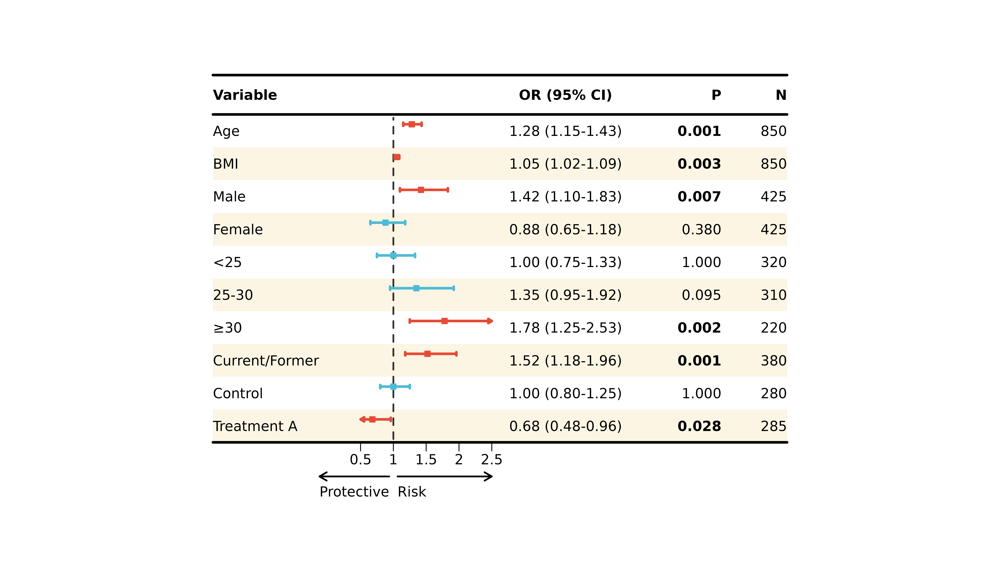

------------------------------------------------------------------------

## 🔄 Multi-Model Comparison

One powerful feature of
[`plot_forest()`](https://evanbio.github.io/evanverse/reference/plot_forest.md)
is comparing multiple regression models side-by-side.

### Preparing Multi-Model Data

``` r
# Filter multi-model data
df_multi <- forest_data %>%
  filter(!is.na(est_2))          # Has multiple models

# Create display table with multiple model columns
plot_data_multi <- df_multi %>%
  mutate(
    ` ` = strrep(" ", 15),
    `Model 1` = sprintf("%.2f (%.2f-%.2f)", est, lower, upper),
    `Model 2` = sprintf("%.2f (%.2f-%.2f)", est_2, lower_2, upper_2),
    `Model 3` = sprintf("%.2f (%.2f-%.2f)", est_3, lower_3, upper_3)
  ) %>%
  select(Variable = variable, ` `, `Model 1`, `Model 2`, `Model 3`)

print(plot_data_multi)
#>              Variable                          Model 1          Model 2
#> 1        Hypertension                 1.85 (1.42-2.41) 1.72 (1.32-2.24)
#> 2            Diabetes                 2.12 (1.58-2.84) 1.95 (1.45-2.62)
#> 3 Physical inactivity                 1.42 (1.08-1.87) 1.35 (1.03-1.77)
#>            Model 3
#> 1 1.58 (1.20-2.08)
#> 2 1.78 (1.31-2.42)
#> 3 1.28 (0.97-1.69)
```

### Basic Multi-Model Plot

``` r
p13 <- plot_forest(
  data = plot_data_multi,
  est = list(df_multi$est, df_multi$est_2, df_multi$est_3),
  lower = list(df_multi$lower, df_multi$lower_2, df_multi$lower_3),
  upper = list(df_multi$upper, df_multi$upper_2, df_multi$upper_3),
  ci_column = 2,
  ref_line = 1,
  xlim = c(0.5, 3)
)
#> 
#> ── Layout Adjustment Summary
#> ℹ Column Widths (mm):
#> Default: 5, 42, 24.2, 38.5, 38.5, 38.5, 24, 5
#> Adjusted: 10, 50, 30, 45, 45, 45, 30, 10
#> width_custom = list({paste(width_code, collapse = ', ')})
#> ℹ Row Heights (mm):
#> Default: 5, 7.1, 6.1, 6.1, 6.1, 9.7, 5
#> Adjusted: 8, 12, 10, 10, 10, 10, 8
#> height_custom = list({paste(height_code, collapse = ', ')})
#> ✔ Tip: Copy and modify the code above for custom dimensions

print(p13)
```

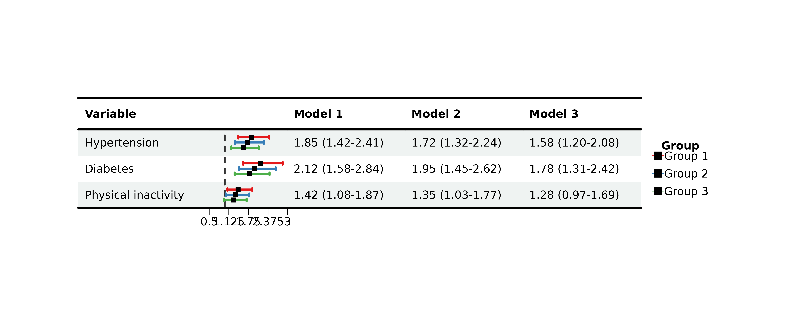

### Adjusting Multi-Model Spacing

Use `nudge_y` to control vertical spacing between models:

``` r
p14 <- plot_forest(
  data = plot_data_multi,
  est = list(df_multi$est, df_multi$est_2, df_multi$est_3),
  lower = list(df_multi$lower, df_multi$lower_2, df_multi$lower_3),
  upper = list(df_multi$upper, df_multi$upper_2, df_multi$upper_3),
  ci_column = 2,
  ref_line = 1,
  xlim = c(0.5, 3),
  nudge_y = 0.3                  # Increase spacing
)
#> 
#> ── Layout Adjustment Summary
#> ℹ Column Widths (mm):
#> Default: 5, 42, 24.2, 38.5, 38.5, 38.5, 24, 5
#> Adjusted: 10, 50, 30, 45, 45, 45, 30, 10
#> width_custom = list({paste(width_code, collapse = ', ')})
#> ℹ Row Heights (mm):
#> Default: 5, 7.1, 6.1, 6.1, 6.1, 9.7, 5
#> Adjusted: 8, 12, 10, 10, 10, 10, 8
#> height_custom = list({paste(height_code, collapse = ', ')})
#> ✔ Tip: Copy and modify the code above for custom dimensions

print(p14)
```

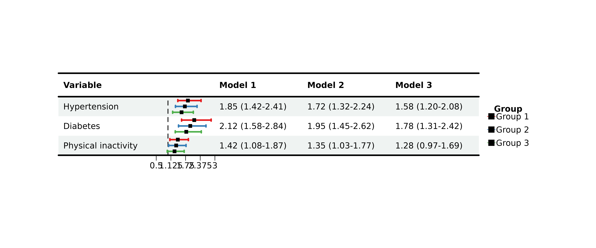

### Customizing Model Appearance

#### Different Sizes per Model

``` r
# IMPORTANT: sizes must match number of ROWS, not models!
# For 3 rows, repeat the pattern
sizes_vec <- rep(0.6, nrow(plot_data_multi))

p15 <- plot_forest(
  data = plot_data_multi,
  est = list(df_multi$est, df_multi$est_2, df_multi$est_3),
  lower = list(df_multi$lower, df_multi$lower_2, df_multi$lower_3),
  upper = list(df_multi$upper, df_multi$upper_2, df_multi$upper_3),
  ci_column = 2,
  ref_line = 1,
  xlim = c(0.5, 3),
  sizes = sizes_vec              # Must match row count!
)
#> 
#> ── Layout Adjustment Summary
#> ℹ Column Widths (mm):
#> Default: 5, 42, 24.2, 38.5, 38.5, 38.5, 24, 5
#> Adjusted: 10, 50, 30, 45, 45, 45, 30, 10
#> width_custom = list({paste(width_code, collapse = ', ')})
#> ℹ Row Heights (mm):
#> Default: 5, 7.1, 6.1, 6.1, 6.1, 9.7, 5
#> Adjusted: 8, 12, 10, 10, 10, 10, 8
#> height_custom = list({paste(height_code, collapse = ', ')})
#> ✔ Tip: Copy and modify the code above for custom dimensions

print(p15)
```

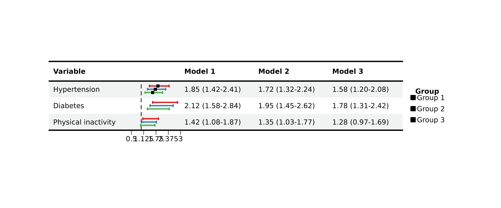

**⚠️ Critical:** The `sizes` parameter must either be: - A single value
(applied to all) - A vector matching `nrow(data)`

If you provide fewer values, later rows will have no CI displayed!

------------------------------------------------------------------------

## 🎯 Advanced Features

### Automatic Tick Generation

When you provide `xlim` without `ticks_at`, the function auto-generates
evenly spaced ticks:

``` r
p16 <- plot_forest(
  data = plot_data,
  est = list(df_single$est),
  lower = list(df_single$lower),
  upper = list(df_single$upper),
  ci_column = 2,
  ref_line = 1,
  xlim = c(0.5, 2.5),
  ticks_at = NULL                # Auto-generate 5 ticks
)
#> 
#> ── Layout Adjustment Summary
#> ℹ Column Widths (mm):
#> Default: 5, 36.3, 30.9, 38.5, 16.1, 12.1, 5
#> Adjusted: 10, 45, 40, 45, 25, 20, 10
#> width_custom = list({paste(width_code, collapse = ', ')})
#> ℹ Row Heights (mm):
#> Default: 5, 7.1, 6.1, 6.1, 6.1, 6.1, 6.1, 6.1, 6.1, 6.1, 6.1, 6.1, 9.7, 5
#> Adjusted: 8, 12, 10, 10, 10, 10, 10, 10, 10, 10, 10, 10, 10, 8
#> height_custom = list({paste(height_code, collapse = ', ')})
#> ✔ Tip: Copy and modify the code above for custom dimensions

print(p16)
```

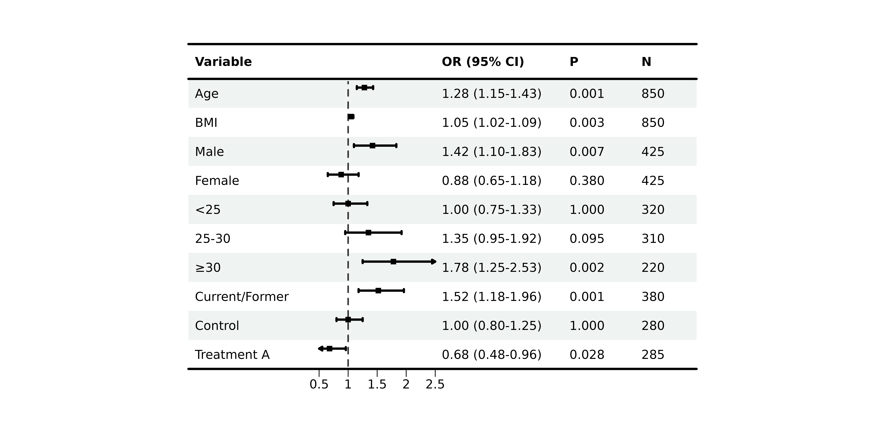

### Layout Fine-Tuning

#### Default Layout Parameters

``` r
# Default values (can be customized)
# height_top = 8        # Top margin
# height_header = 12    # Header row
# height_main = 10      # Data rows
# height_bottom = 8     # Bottom margin
# width_left = 10       # Left margin
# width_right = 10      # Right margin
```

#### Custom Layout

``` r
p17 <- plot_forest(
  data = plot_data,
  est = list(df_single$est),
  lower = list(df_single$lower),
  upper = list(df_single$upper),
  ci_column = 2,
  ref_line = 1,
  height_main = 12,              # Taller rows
  height_bottom = 6,             # Smaller bottom margin
  width_adjust = 8,              # Wider columns
  layout_verbose = TRUE          # Print layout info
)
#> 
#> ── Layout Adjustment Summary
#> ℹ Column Widths (mm):
#> Default: 5, 36.3, 30.9, 38.5, 16.1, 12.1, 5
#> Adjusted: 10, 48, 40, 48, 32, 24, 10
#> width_custom = list({paste(width_code, collapse = ', ')})
#> ℹ Row Heights (mm):
#> Default: 5, 7.1, 6.1, 6.1, 6.1, 6.1, 6.1, 6.1, 6.1, 6.1, 6.1, 6.1, 9.7, 5
#> Adjusted: 8, 12, 12, 12, 12, 12, 12, 12, 12, 12, 12, 12, 12, 6
#> height_custom = list({paste(height_code, collapse = ', ')})
#> ✔ Tip: Copy and modify the code above for custom dimensions

print(p17)
```

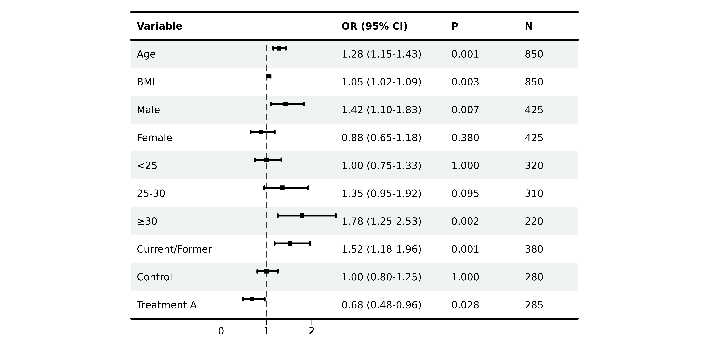

#### Manual Override

For pixel-perfect control:

``` r
p18 <- plot_forest(
  data = plot_data,
  est = list(df_single$est),
  lower = list(df_single$lower),
  upper = list(df_single$upper),
  ci_column = 2,
  ref_line = 1,
  height_custom = list('3' = 15, '4' = 15),  # Specific rows
  width_custom = list('2' = 80, '3' = 100),  # Specific columns
  layout_verbose = FALSE
)

print(p18)
```

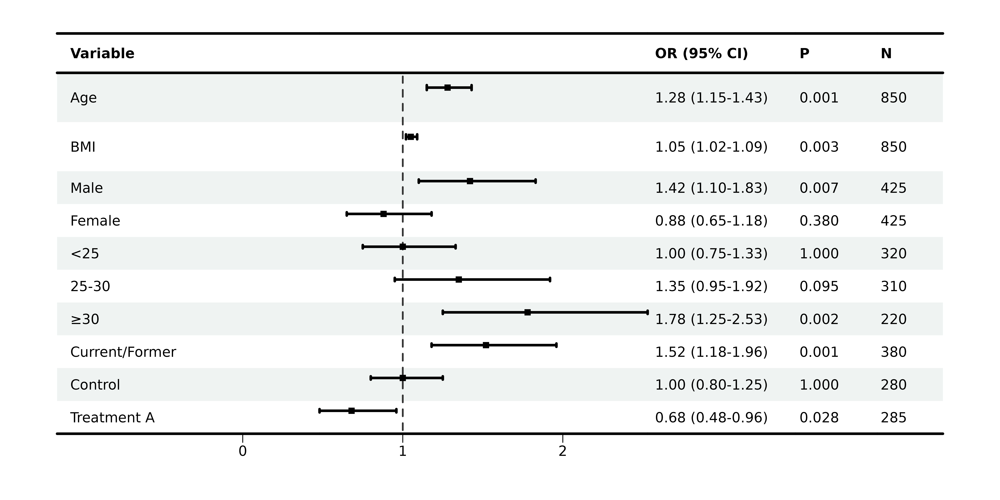

### Saving Plots

``` r
# Save to multiple formats
p19 <- plot_forest(
  data = plot_data,
  est = list(df_single$est),
  lower = list(df_single$lower),
  upper = list(df_single$upper),
  ci_column = 2,
  ref_line = 1,
  save_plot = TRUE,
  filename = "my_forest_plot",
  save_path = "output",
  save_formats = c("png", "pdf", "tiff"),
  save_width = 30,
  save_height = 25,
  save_dpi = 300
)
```

------------------------------------------------------------------------

## 📚 Real-World Examples

### Example 1: Logistic Regression Results

``` r
# Simulate logistic regression results
set.seed(123)
logistic_results <- data.frame(
  Variable = c(
    "Demographics", "  Age (per 10 years)", "  Male sex",
    "Clinical", "  BMI ≥30", "  Hypertension", "  Diabetes",
    "Laboratory", "  CRP >3 mg/L", "  LDL-C >130 mg/dL"
  ),
  OR = c(NA, 1.35, 0.82, NA, 1.58, 1.42, 1.67, NA, 1.44, 1.28),
  Lower = c(NA, 1.15, 0.65, NA, 1.22, 1.18, 1.32, NA, 1.15, 1.02),
  Upper = c(NA, 1.58, 1.03, NA, 2.05, 1.71, 2.11, NA, 1.81, 1.61),
  P = c(NA, 0.001, 0.085, NA, 0.001, 0.001, 0.001, NA, 0.002, 0.035)
)

# Prepare display
logistic_display <- logistic_results %>%
  mutate(
    ` ` = strrep(" ", 20),
    `OR (95% CI)` = ifelse(is.na(OR), "",
                           sprintf("%.2f (%.2f-%.2f)", OR, Lower, Upper)),
    `P-value` = ifelse(is.na(P), "",
                       ifelse(P < 0.001, "<0.001", sprintf("%.3f", P)))
  ) %>%
  select(Variable, ` `, `OR (95% CI)`, `P-value`)

# Identify group headers
group_rows <- c(1, 4, 7)

# Create plot
p_logistic <- plot_forest(
  data = logistic_display,
  est = list(logistic_results$OR),
  lower = list(logistic_results$Lower),
  upper = list(logistic_results$Upper),
  ci_column = 2,
  ref_line = 1,
  xlim = c(0.5, 2.5),
  arrow_lab = c("Protective", "Risk Factor"),

  align_left = 1,
  align_center = 2,
  align_right = c(3, 4),

  bold_group = logistic_display$Variable[group_rows],
  bold_pvalue_cols = 4,
  p_threshold = 0.05,

  background_style = "group",
  background_group_rows = group_rows,

  ci_colors = ifelse(is.na(logistic_results$P) | logistic_results$P >= 0.05,
                     "#CCCCCC", "#E64B35"),

  add_borders = TRUE,
  layout_verbose = FALSE
)

print(p_logistic)
```

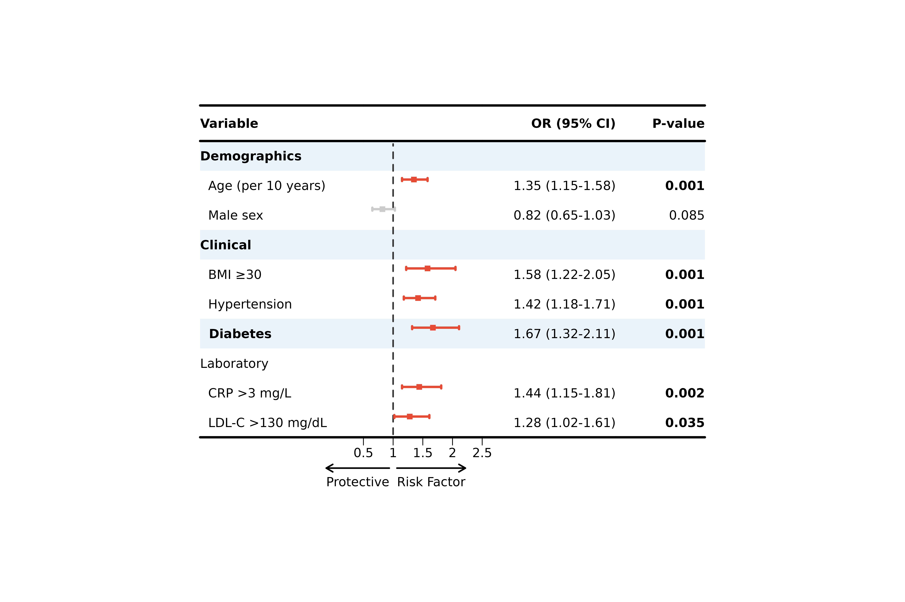

### Example 2: Cox Regression (Survival Analysis)

``` r
# Survival analysis hazard ratios
cox_results <- data.frame(
  Gene = c("BRCA1", "BRCA2", "TP53", "EGFR", "MYC",
           "KRAS", "PIK3CA", "AKT1", "PTEN"),
  HR = c(1.45, 0.78, 2.12, 1.23, 0.91, 1.87, 1.56, 0.85, 1.34),
  Lower = c(1.18, 0.61, 1.58, 0.95, 0.72, 1.42, 1.20, 0.66, 1.05),
  Upper = c(1.78, 0.99, 2.84, 1.59, 1.15, 2.46, 2.03, 1.09, 1.71),
  P = c(0.001, 0.041, 0.001, 0.124, 0.412, 0.001, 0.001, 0.235, 0.018)
)

cox_display <- cox_results %>%
  mutate(
    ` ` = strrep(" ", 20),
    `HR (95% CI)` = sprintf("%.2f (%.2f-%.2f)", HR, Lower, Upper),
    `P-value` = ifelse(P < 0.001, "<0.001", sprintf("%.3f", P))
  ) %>%
  select(Gene, ` `, `HR (95% CI)`, `P-value`)

p_cox <- plot_forest(
  data = cox_display,
  est = list(cox_results$HR),
  lower = list(cox_results$Lower),
  upper = list(cox_results$Upper),
  ci_column = 2,
  ref_line = 1,
  xlim = c(0.5, 3),
  arrow_lab = c("Better Survival", "Worse Survival"),

  align_left = 1,
  align_right = c(3, 4),

  bold_pvalue_cols = 4,
  p_threshold = 0.05,

  background_style = "zebra",

  ci_colors = ifelse(cox_results$P < 0.05, "#E64B35", "#4DBBD5"),

  add_borders = TRUE,
  height_main = 10,
  layout_verbose = FALSE
)

print(p_cox)
```

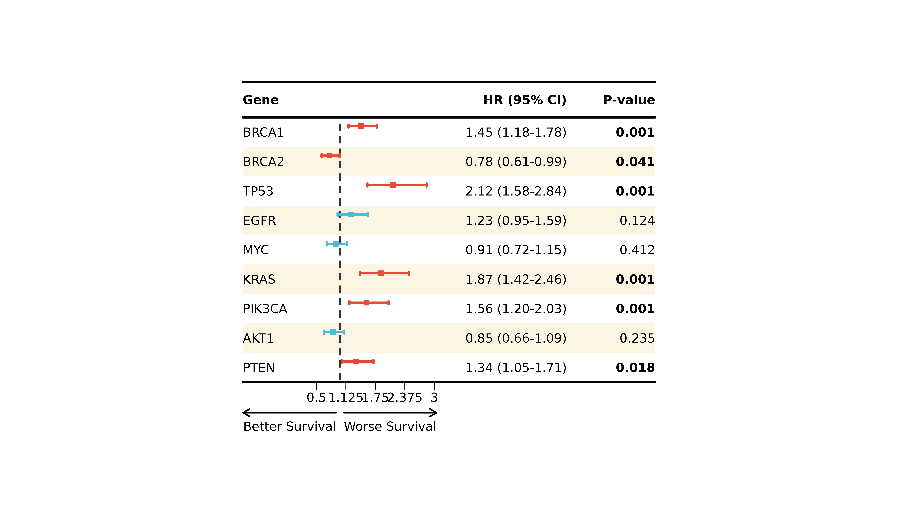

### Example 3: Model Comparison (Adjusted vs Unadjusted)

``` r
# Use built-in multi-model data
comparison_display <- plot_data_multi %>%
  mutate(Note = c(
    "Crude model",
    "Age + Sex adjusted",
    "Fully adjusted"
  )) %>%
  select(Variable, ` `, `Model 1`, `Model 2`, `Model 3`, Note)

p_comparison <- plot_forest(
  data = comparison_display,
  est = list(df_multi$est, df_multi$est_2, df_multi$est_3),
  lower = list(df_multi$lower, df_multi$lower_2, df_multi$lower_3),
  upper = list(df_multi$upper, df_multi$upper_2, df_multi$upper_3),
  ci_column = 2,
  ref_line = 1,
  xlim = c(0.5, 3),
  nudge_y = 0.25,

  align_left = 1,
  align_center = c(3, 4, 5),
  align_right = 6,

  add_borders = TRUE,
  border_width = 4,

  layout_verbose = FALSE
)

print(p_comparison)
```

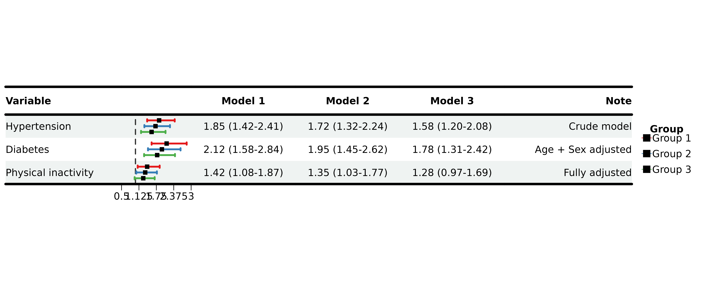

------------------------------------------------------------------------

## 💡 Best Practices

### Data Preparation Checklist

✅ **Format effect estimates** - Use
[`sprintf()`](https://rdrr.io/r/base/sprintf.html) for consistent
decimals ✅ **Create blank column** - Use `strrep(" ", width)` for CI
graphics ✅ **Handle missing values** - Use
`ifelse(is.na(...), "", ...)` for display ✅ **Separate display and
numeric** - Keep est/lower/upper as separate vectors ✅ **Order columns
logically** - Variable → Blank → Results → P-value

### Design Guidelines

#### Color Selection

- **Use colorblind-friendly palettes** - Test with ColorBrewer or
  viridis
- **Limit colors** - 2-3 colors for clarity
- **Consistent meaning** - Red = risk, Blue = protective, Gray =
  non-significant

#### Typography

- **Left-align text** - Variable names, descriptions
- **Right-align numbers** - P-values, counts
- **Center CI graphics** - Visual balance

#### Statistical Reporting

- **Show uncertainty** - Always include confidence intervals
- **Report exact p-values** - Except for very small values (\<0.001)
- **Mark significance** - Use bold or color, but consistently

### Common Pitfalls

❌ **Wrong sizes vector length** - Must match `nrow(data)`, not number
of models ❌ **Forgetting blank column** - CI graphics need empty space
❌ **Inconsistent formatting** - Use
[`sprintf()`](https://rdrr.io/r/base/sprintf.html) for uniform decimals
❌ **Too many decimals** - 2-3 is usually sufficient ❌ **Cluttered
axis** - Use appropriate xlim and tick spacing

### Workflow Tips

#### 1. Start Simple

``` r
# Minimal working example first
p <- plot_forest(data, est, lower, upper, ci_column = 2)
```

#### 2. Add Customizations Incrementally

``` r
# Then add features one by one
p <- plot_forest(
  ...,
  align_left = 1,           # Step 1
  bold_pvalue_cols = 4,     # Step 2
  background_style = "zebra" # Step 3
)
```

#### 3. Use layout_verbose for Debugging

``` r
p <- plot_forest(..., layout_verbose = TRUE)
# Check printed dimensions
# Adjust with height_custom/width_custom if needed
```

#### 4. Save Final Version

``` r
p <- plot_forest(...,
                 save_plot = TRUE,
                 filename = "final_forest",
                 save_formats = c("png", "pdf"))
```

------------------------------------------------------------------------

## 📖 Parameter Reference

### Essential Parameters

| Parameter   | Type       | Default | Description                        |
|-------------|------------|---------|------------------------------------|
| `data`      | data.frame | \-      | Display data with all text columns |
| `est`       | list       | \-      | Effect estimates (list of vectors) |
| `lower`     | list       | \-      | Lower CI bounds (list of vectors)  |
| `upper`     | list       | \-      | Upper CI bounds (list of vectors)  |
| `ci_column` | integer    | \-      | Column index for CI graphics       |
| `ref_line`  | numeric    | 1       | Reference line position            |

### Customization Parameters

| Category       | Parameters                                                        |
|----------------|-------------------------------------------------------------------|
| **Theme**      | `theme_preset`, `theme_custom`                                    |
| **Alignment**  | `align_left`, `align_center`, `align_right`                       |
| **Bold**       | `bold_group`, `bold_group_col`, `bold_pvalue_cols`, `p_threshold` |
| **Background** | `background_style`, `background_group_rows`, `background_colors`  |
| **Colors**     | `ci_colors`, `ci_group_ids`                                       |
| **Borders**    | `add_borders`, `border_width`, `custom_borders`                   |
| **Layout**     | `height_*`, `width_*`, `nudge_y`, `sizes`                         |
| **Save**       | `save_plot`, `filename`, `save_path`, `save_formats`              |

For complete parameter documentation, see
[`?plot_forest`](https://evanbio.github.io/evanverse/reference/plot_forest.md).

------------------------------------------------------------------------

## 🎓 Summary

You’ve learned how to:

✅ Create basic forest plots with
[`plot_forest()`](https://evanbio.github.io/evanverse/reference/plot_forest.md)
✅ Customize themes, colors, and alignment ✅ Compare multiple models
side-by-side ✅ Apply backgrounds, borders, and formatting ✅ Fine-tune
layouts and save publication-ready figures ✅ Follow best practices for
statistical visualization

### Next Steps

- **Explore other vignettes** - [Get
  Started](https://evanbio.github.io/evanverse/articles/get-started.md),
  [Color
  Palettes](https://evanbio.github.io/evanverse/articles/color-palettes.md)
- **Check function documentation** -
  [`?plot_forest`](https://evanbio.github.io/evanverse/reference/plot_forest.md),
  [`?forest_data`](https://evanbio.github.io/evanverse/reference/forest_data.md)
- **Share your plots** - Tag us on GitHub with your beautiful forest
  plots!

------------------------------------------------------------------------

**📦 Package:** [evanverse](https://github.com/evanbio/evanverse) **📧
Questions?** Open an issue on GitHub **🌟 Like this package?** Give us a
star!

*Happy plotting! 🌲📊*
